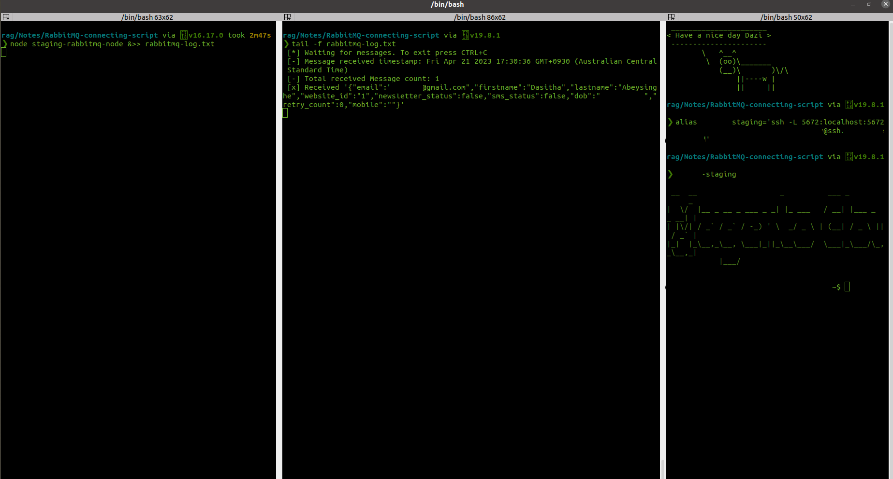

# RabbitMq queue messages
This repository will have scripts related to RabbitMq queue message reading and other actions

## Create a binding queue
- Create a new queue in the RabbitMq dashboard and configure it's bindings similar to the queue which you need to intercept the messages.

## Run the script

- You need to run the `npm install amqplib`
- After that run the script and review the received messages to binded queue
- More info: https://github.com/amqp-node/amqplib/blob/main/examples/tutorials/receive.js

Cheers! 😉 
